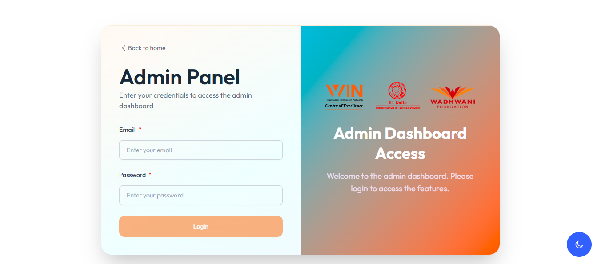

# {process.env.NEXT_PUBLIC_COMPANY_NAME} — Wincoe Admin Panel



Welcome to the official **Wincoe Admin Panel**, a customized dashboard built on top of the powerful **TailAdmin Next.js Template**. This panel is developed for managing the backend of **[wincoe.in](https://wincoe.in)** and includes all the essential UI components, pages, and features required for a modern, responsive admin system.

Built using:
- ✅ **Next.js 15** (App Router + Server Components)
- ⚛️ **React 19**
- 🟦 **TypeScript**
- 🎨 **Tailwind CSS v4**

---

## 🌐 Live Links

- Website: [https://wincoe.in](https://wincoe.in)
- Admin Preview: _Coming Soon (Internal Use Only)_
- Documentation: _Private/Internal_

---

## 🚀 Features

- ⚙️ Fully responsive layout with collapsible sidebar
- 🔐 Role-based access control (Admin / Editor / Viewer)
- 📆 Calendar & Event countdown integration
- 📰 News, Grants, Events, and Document management
- 📸 Dynamic gallery with YouTube & Google Drive video preview
- ✍️ Rich text editor using Summernote
- 📊 Interactive Charts using ApexCharts
- 🌑 Dark Mode support
- 📁 File upload & media preview system

---

## 🛠️ Installation

### Prerequisites

Make sure the following are installed:

- Node.js **v18 or later** (recommended: v20+)
- Git

### Step-by-Step Setup

1. **Clone the repo:**

```bash
git clone https://github.com/TailAdmin/free-nextjs-admin-dashboard.git wincoe-admin
cd wincoe-admin
